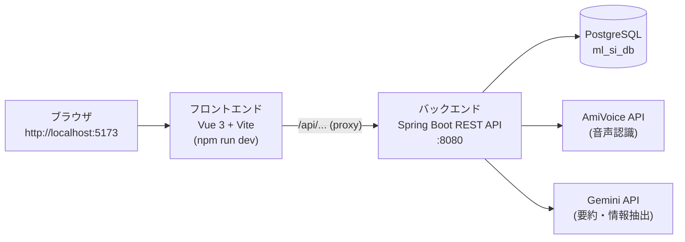

# 2026年サマーインターン

AIを活用した「音声のテキスト化・要約・情報抽出」アプリケーションを開発します。

## システム構成

バックエンド（Spring Boot / REST API）とフロントエンド（Vue 3 / Vite）が分離した構成です。
それぞれ別のプロセスとして起動し、フロントエンドからHTTP（JSON）でバックエンドAPIを呼び出します。



| ディレクトリ | 内容 | 技術スタック |
|---|---|---|
| `backend/` | REST APIサーバ | Java 17 / Spring Boot / JPA / PostgreSQL |
| `frontend/` | 画面（SPA） | Vue 3 / Vite / JavaScript |

## 開発環境の準備

開発にはVS Codeを使用します。

### 必要なソフトウェア

| ソフトウェア | バージョン | 用途 |
|---|---|---|
| VS Code | 最新 | エディタ（このリポジトリを開くと推奨拡張機能のインストールが提案されます） |
| Java (JDK) | 17 | バックエンド |
| Node.js | 20 LTS以上 | フロントエンド |

> Mavenのインストールは不要です。VS CodeのJava拡張機能が依存ライブラリの解決からビルド・起動まで行います
> （ターミナルから `mvn spring-boot:run` したい場合のみMavenをインストールしてください）。

### VS Codeのセットアップ

1. VS Codeで**このリポジトリのルートフォルダ**を開く
2. 右下に表示される「推奨拡張機能をインストールしますか？」に従ってインストール
   - Extension Pack for Java（Java開発一式）
   - Spring Boot Extension Pack（Spring Boot支援）
   - Vue - Official（Vue 3開発）

### APIキーの設定（.envファイル）

APIキーは `.env` ファイルから読み込みます（キーの値は当日運営から共有します）。

```bash
cd backend
copy .env.example .env      # Windowsの場合（Mac/Linuxは cp）
```

作成した `backend/.env` に共有された値を記入してください。

> ⚠️ `.env` はgit管理外です。APIキーやパスワードを `application.properties` に直接書いてコミットしないでください。

### バックエンドの起動

**方法1（推奨）: VS Codeからデバッグ起動**

「実行とデバッグ」パネル（Ctrl+Shift+D）で「backend (Spring Boot)」を選んでF5。
`.env` の内容は自動で読み込まれます。ブレークポイントも使えます。

**方法2: ターミナルから起動（Mavenインストール済みの場合のみ）**

```powershell
cd backend
$env:GEMINI_API_KEY   = "（共有されたキー）"
$env:AMIVOICE_API_KEY = "（共有されたキー）"
$env:DB_PASSWORD      = "（共有されたパスワード）"
mvn spring-boot:run
```

- 起動後、`http://localhost:8080/api/summaries` にアクセスしてJSONが返ればOK
- `application.properties` の `currentSchema`・DBユーザー名は**各チームブランチに設定済み**です（masterから直接起動する場合のみ、対象スキーマに合わせて変更してください）

### フロントエンドの起動

```bash
cd frontend
npm install
npm run dev
```

- 起動後、`http://localhost:5173` にアクセスして一覧画面が表示されればOK
- `/api/...` へのリクエストはViteのproxy設定で自動的にバックエンド（8080）へ転送されます

## Git ブランチ運用ガイド

### ブランチ構成概要

```
master（ML社員管理用）
├── 1st_groupA
│   └── feature/group_A_{機能名}
├── 2nd_groupA
│   └── feature/group_A_{機能名}
└── 3rd_groupA
    └── feature/group_A_{機能名}
```

- master：ML社員運営用のベースブランチ（直接操作禁止）
- {1st/2nd/3rd}_group{N}：各開催回 × 各チームごとの開発ブランチ
- feature/group_{N}_xxx：チームメンバーが作業する機能単位

### ブランチ命名規則

| ブランチ種別 | 命名例 | 説明 | 作成者 |
|---|---|---|---|
| チームブランチ | 1st_groupA | 1回目 × チームA | ML社員 |
| 機能ブランチ | feature/group_A_XXX | 作業内容に応じて命名 | サマーインターン参加メンバー |

### 開発フロー

1. 自身のチームブランチ（{1st/2nd/3rd}_group{N}）から、自分の作業用に feature/xxx ブランチを作成します
2. コードの追加・変更をコミットし、feature/xxx ブランチにpush
3. チームブランチへPull Request(PR)を作成してレビュー・マージ（レビューは任意、実施はチームメンバーまたはML社員への相談も可）
4. チームで協力して、チームブランチ（{1st/2nd/3rd}_group{N}）に成果物をまとめてください
5. 最終日、チームブランチの状態を提出（GitHubに残して完了）

## API一覧

| メソッド | パス | 内容 | 状態 |
|---|---|---|---|
| GET | /api/summaries | 登録済みデータの一覧取得 | 実装済み（サンプル） |
| GET | /api/audio-files | サンプル音声ファイルの一覧取得 | 実装済み（サンプル） |
| POST | /api/transcribe-and-summarize | 音声認識＋AI要約＋情報抽出の実行 | **皆さんが実装** |
| PUT | /api/summaries/{id} | テキスト・要約の更新 | **皆さんが実装** |
| DELETE | /api/summaries/{id} | レコードの削除（論理削除） | **皆さんが実装** |

※ パス・メソッドはあくまで例です。チームで設計して自由に変更してください。

## データベーステーブル定義書

### audio_transcription_summary（音声転写・要約管理）

| 項番 | 論理名 | 物理名 | 属性 | DDL指定 | 桁数 | Not Null制約 | PK | 説明 |
|------|--------|--------|------|---------|------|---------------|----|------|
| 1 | 転写ID | transcription_id | SERIAL | - | - | Not Null | ○ | 自動採番される一意識別子 |
| 2 | 音声ファイル名 | audio_file_name | VARCHAR | - | 255 | - | - | 音声ファイルの名称 |
| 3 | 音声テキスト | transcription_text | TEXT | - | - | - | - | 音声から転写されたテキスト |
| 4 | 要約テキスト | summary_text | TEXT | - | - | - | - | AIが要約したテキスト |
| 5 | AI抽出: 氏名 | extracted_name | VARCHAR | - | 100 | - | - | 通話内容からAIが抽出した氏名 |
| 6 | AI抽出: 電話番号 | extracted_phone | VARCHAR | - | 20 | - | - | 通話内容からAIが抽出した電話番号 |
| 7 | AI抽出: 用件 | extracted_subject | VARCHAR | - | 255 | - | - | 通話内容からAIが抽出した用件（1行サマリ） |
| 8 | 論理削除フラグ | is_logical_deleted | BOOLEAN | DEFAULT FALSE | - | Not Null | - | 論理削除フラグ（デフォルト: false） |
| 9 | 登録日時 | created_at | TIMESTAMP | DEFAULT CURRENT_TIMESTAMP | - | Not Null | - | レコード作成日時（デフォルト: 現在時刻） |
| 10 | 更新日時 | updated_at | TIMESTAMP | DEFAULT CURRENT_TIMESTAMP | - | Not Null | - | レコード更新日時（デフォルト: 現在時刻） |
